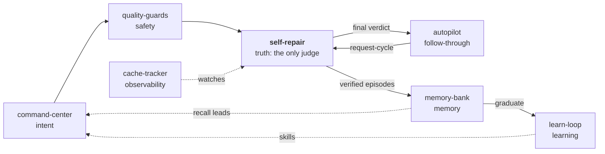

# command-code-mods

A composable suite of agent mods that turn Command Code into a self-verifying,
self-improving engineering system.


[](https://opensource.org/licenses/MIT)

## Why this exists

LLM agents are great at generating code and mediocre at knowing when they're
done. This suite gives an agent **slots for the abilities a careful engineer
exercises deliberately**:

- **Intent** — plan before building, with decisions made explicitly.
- **Safety** — catch failure loops, destructive commands, and scope drift.
- **Truth** — a completion *judge* that is not the worker itself.
- **Follow-through** — bounded, verified initiative after the judge signs off.
- **Memory** — durable project facts, gated so they can't rot.
- **Learning** — the agent's workflow patterns, distilled into loadable skills.
- **Protocols** — portable `.agents/protocols/` playbooks, activated on demand
  the way skills fire on their descriptions.
- **Observability** — measured, not assumed: real prompt-cache hit rates and
  suite-wide error rates.

The architectural bet: **separation of concerns between agentic components**.
The worker (the model) never marks its own work done. The judge (self-repair)
never executes. The momentum engine (autopilot) never verifies. They
communicate through a small, versioned event contract — the mods are the
system, the events are the API.

## The pipeline



The core invariant: **self-repair is the only completion judge.** Autopilot
only gains initiative after a verified completion verdict — and every
autopilot action opens a fresh child verification cycle before anything else
may happen. No referee judgment, no initiative.

Two cross-cutting mods sit outside the linear pipeline. **error-tracker** is a
pure observer of the harness's own error events (per-mod `mod_error`, per-tool
`tool_errored`, `run_error`, `api_retry`, `interrupted`) with a footer badge
and a redacted, lock-appended JSONL ledger — it registers no prompt hooks, so
it can never affect the runs it watches. **protocol-loader** discovers
`.agents/protocols/*.md` and activates a protocol when its "Run when …"
trigger matches your prompt (or explicitly via `/protocol <name>`), riding the
message tail so the system prompt stays byte-stable.

## Mods

| Mod | What it does | Key capabilities |
|---|---|---|
| [`command-center`](mods/command-center.ts) | Structured planning: decision funnel → plan artifact → review | Multi-round briefing state machine, plan compilation, review mode with write-blocks, per-state system prompts (cache-stable) |
| [`quality-guards`](mods/quality-guards.ts) | Advisory safety warnings — never blocks | Failure coaching (escalating), loop detection, overwrite guard, destructive-git warning, build guard, test/token budgets, drift detection, run-length estimation |
| [`self-repair`](mods/self-repair.ts) | The completion judge — the only verdict emitter | Self-review gate before "done", evidence collection (inspection commands can't fake it), crash checkpoints, interruption resume, task continuity |
| [`autopilot`](mods/autopilot.ts) | Verified-momentum engine | Tiered follow-ups (green executes / yellow proposes / red never), budget-capped initiative, synchronous referee handshake, scope + forbidden-pattern enforcement, receipt ledger |
| [`memory-bank`](mods/memory-bank.ts) | Durable, gated project memory | L1 events / L2 pointer registry / L3 lessons, recall injection, write-bar (only verified completions + explicit writes), auto-graduation into skills |
| [`learn-loop`](mods/learn-loop.ts) | Autonomous skill lifecycle manager | Seeds candidates from user corrections, self-distillation turns, shadow trials with green/red stats, promotion on verified verdicts, merge review, decay/archive — receipts for every move |
| [`cache-tracker`](mods/cache-tracker.ts) | Prompt-cache observability | Live hit-rate footer, per-run JSONL ledger, `/cache` history — registers no prompt hooks, so it can't perturb what it measures |
| [`protocol-loader`](mods/protocol-loader.ts) | On-demand protocols, like skills | Discovers `.agents/protocols/*.md` in cwd and ancestor workspaces, trigger-matches frontmatter "Run when …" against typed prompts, `/protocol` explicit load, `/protocols` list with load state, tail injection that never touches the system prompt |
| [`error-tracker`](mods/error-tracker.ts) | Suite-wide error observability | Pure observer of harness error events: `mod_error` per mod→hook, `tool_errored` per tool (attributed via the `tool_queued` call-id map), `run_error`, `api_retry`, `interrupted`; footer badge; redacted, retention-capped JSONL ledger; `/errors` report and `/errors-clear` |

## Design principles

- **Pipeline of single-responsibility modules.** Each mod owns one job and is
  useless without the previous one. No shared code between mods — the event
  schema is the contract, and every mod is standalone-installable.
- **Receipts, not confidence.** Every autonomous action leaves a verifiable
  audit trail: what ran, why it belonged, how it was verified, how to undo it.
- **Tiered, budget-capped autonomy.** The gate on an autonomous action scales
  with its cost — cheap actions may fire on weak signals, expensive or
  irreversible actions require verified evidence, and loops are hard-capped.
- **Measurement that doesn't perturb the measured.** The cache tracker
  registers no prompt hooks; the system prompt stays byte-stable across
  turns so provider prefix-caching keeps its hits.
- **Ownership boundaries, mechanically enforced.** learn-loop only manages
  skills it installed itself (a `.managed.json` marker), and refuses to touch
  user-installed artifacts.

## Engineering discipline

This repo is the artifact of its own mods — the review loop, the memory
bank, and the learning loop all ran against it.

- **Mechanical contract checking** — `node scripts/check-contracts.mjs`
  validates cross-mod event pairing, command/tool/renderer uniqueness,
  per-mod flag prefixes, and exec timeouts. Runs in CI on every push.
- **Per-mod changelog** — every behavior change updates `CHANGELOG.md` in the
  same commit, organized by mod.
- **Postmortems are documentation** — AGENTS.md records the wire-contract
  crash postmortem (string-content messages) and the cache rules it taught us.
- **Personal data never enters history** — `.gitignore` keeps runtime state
  (memory stores, receipts, cache stats) out of the public repo.

## Measured prompt-cache performance

`cache-tracker` measures the suite's own cache hit rate
(`cacheRead / (input + cacheRead + cacheWrite)` — the provider's disjoint
token buckets). Real numbers from this repo's own sessions on DeepSeek V4:

| Session | Requests | Input | Cache read | Hit rate |
|---|---|---|---|---|
| Interactive review (25 turns) | 25 | 6,649,218 | 6,317,312 | **48.7%** |
| One-shot headless runs (median) | 1 | ~21.4K | ~5.4K | 10.7–29.8% |

One-shot runs are the cold-start worst case — the system prompt re-processes
once per run. The interactive session shows the cache discipline paying off:
the stable system prompt prefix stays cached turn after turn. Hit rates are
provider- and session-dependent; `/cache` shows your own live numbers.

## Install

Install the full suite:

```bash
commandcode mods add -g FishRaposo/command-code-mods
commandcode mods list    # verify: nine mods, zero load warnings
```

Install a single mod by keeping only what you want via the object form of
`mods.sources` in `~/.commandcode/settings.json`:

```json
{
  "mods": {
    "sources": [
      {"source": "FishRaposo/command-code-mods", "mods": ["learn-loop.ts"]}
    ]
  }
}
```

Drop `-g` for project scope. On Windows the binary is `commandcode` (alias
`command-code`); docs elsewhere shorten it to `cmd`.

## Repository layout

```
command-code-mods/
├── mods/                    # One TypeScript file per mod, standalone-installable
├── scripts/
│   └── check-contracts.mjs  # Mechanical cross-mod contract check (runs in CI)
├── package.json             # Manifest — declares mods via glob, files whitelist
├── CHANGELOG.md             # Per-mod change history
├── AGENTS.md                # Maintenance disciplines + crash postmortems
├── .github/workflows/       # CI
└── LICENSE                  # MIT
```

## Contributing

See [CONTRIBUTING.md](CONTRIBUTING.md). The short version: one behavior
change = one conventional commit + a CHANGELOG entry in the same commit,
and `node scripts/check-contracts.mjs` must pass.

## License

MIT
